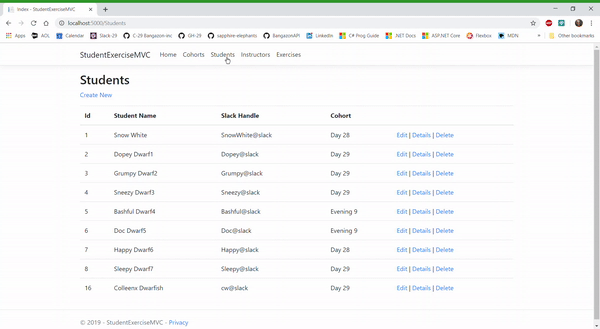

## Welcome to Student Exercises MVC

An ASP.NET MVC application that manages Students, Instructors, Cohorts and Student Assignments. There is CRUD for all modules and a list of students in Cohort details. The Edit feature allows the user to change the student's Cohort via a dropdown select. Current exercises can be deleted and new exercises can be added, all in the same edit.

#### 1. Create a CohortsController in your controllers directory.
* Create a Views > Cohorts directory and use the scaffolding to the create the Index, Details, Create, Edit, and Delete views.
* In your controller, use ADO.NET to execute SQL statements for all of those actions.

#### 2. Display a List of Instructors
* Use scaffolding to... Create an InstructorsController in your controllers directory.
* Create a Views > Instructors directory and use the scaffolding to the create the Index, Details, Create, Edit, and Delete views.
* In your controller, use ADO.NET to execute SQL statements for all of those actions.
* When you create or edit an instructor, you should be able to assign the instructor to a cohort from a select element in the form.

#### 3. Display a List of Students
* Use scaffolding to... Create a StudentsController in your controllers directory.
* Create a Views > Students directory and use the scaffolding to the create the Index, Details, Create, Edit, and Delete views.
* In your controller, use ADO.NET to execute SQL statements for all of those actions.
* When you create or edit a student, you should be able to assign the student to a cohort from a select element in the form.

#### 4. Display a List of Exercises
* Use scaffolding to... Create an ExercisesController in your controllers directory.
* Create a Views > Exercises directory and use the scaffolding to the create the Index, Details, Create, Edit, and Delete views.
* In your controller, use ADO.NET to execute SQL statements for all of those actions.

#### 5. Assigning Exercises to Students
* EDIT - Modify your student edit form to display all exercises in a multi-select element. 
* The user should be able to select one, or more exercises, in that element. When the user submits the form, then the 
* StudentExercises table in your database should have a new entry added for each of the exercises that were selected in the form.

* DETAILS - When you view the details of an individual student, then there should be a list of assigned exercises in the view.
